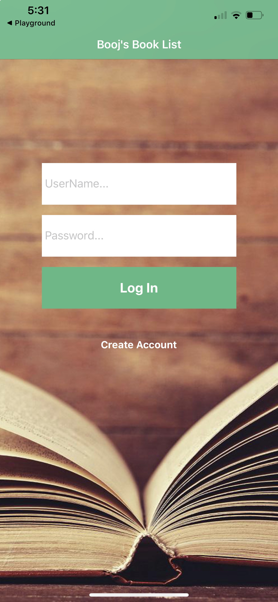
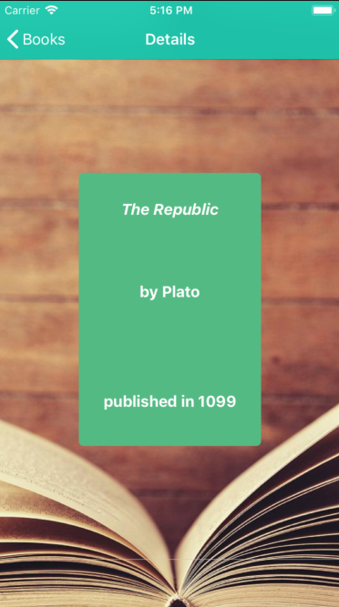

# Booj's Book List

Booj's Book List is a take home project that allows users to add, browse, and remove books. Books can be sorted alphabetically by title or author, and each book can be inspected for further details. 

## Teck Stack

The Front End was built with [NativeScript Vue](https://nativescript-vue.org/en/docs/introduction/), not to be confused with Vue Native. [Mocha/Chai](https://mochajs.org/) were used for unit testing. And the NativeScript [PlayGround](https://apps.apple.com/us/app/nativescript-playground/id1263543946?ls=1) and [Preview](https://apps.apple.com/us/app/nativescript-preview/id1264484702) Apps were used as a simulator to build this project. 

## Screen Shots

  
